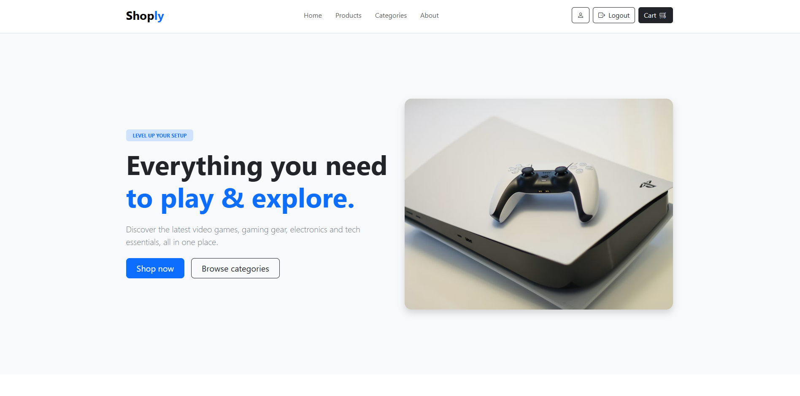
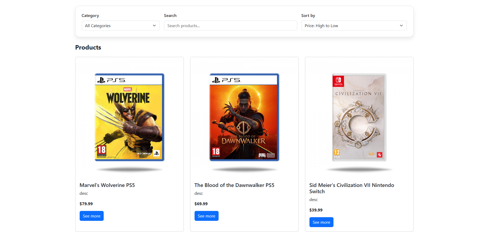
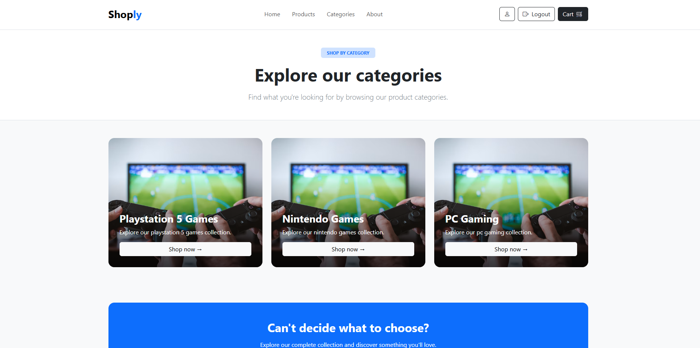
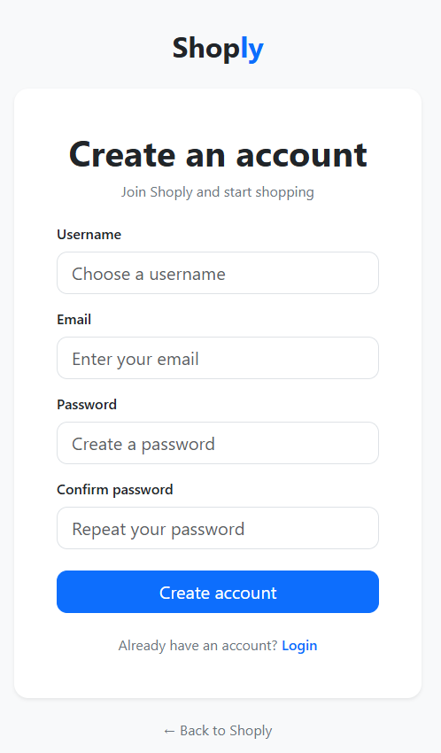

# Shoply - Online Video Game Store

Shoply is a full-stack e-commerce web application for browsing and purchasing video games and other technology products.

The project was developed to practice full-stack web development, with a focus on Java and Spring Boot backend development, REST APIs, authentication, database integration, and React frontend development.

## Technologies

### Backend
- Java
- Spring Boot
- Spring Data JPA
- Spring Security
- JWT
- MySQL
- Maven
- REST API

### Frontend
- React
- Vite
- JavaScript
- Bootstrap
- HTML5
- CSS3

## Features

### Product Catalog
- Browse all available products
- View detailed product information
- Filter products by category
- Sort and search products
- Browse available product categories

### User Authentication
- User registration
- User login
- JWT-based authentication
- Protected user profile
- Logout functionality
- Password encryption using BCrypt

### Password Management
- Forgot password functionality
- Password reset via email
- Secure password reset token
- Reset token expiration
- Change password from the user profile

### User Profile
- View account information
- View username and email
- Change account password

## Screenshots

### Homepage

### Products Page

### Categories Page

### Register Page

### My Profile

### Reset Forgotten Password

